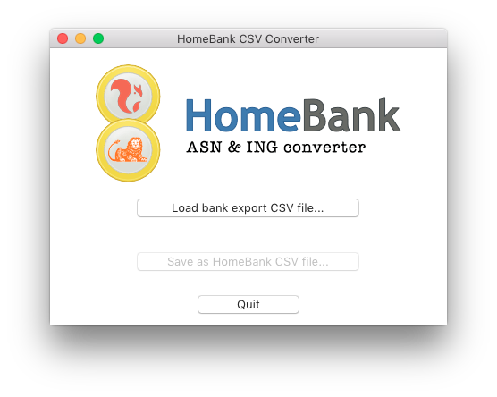

# HomeBank CSV Converter for ASN Bank (NL) & ING Bank (NL) 🇳🇱

If you are a user of the [HomeBank](http://homebank.free.fr/en/index.php) accounting software, you'll probably like to import transaction data from your bank into HomeBank. I am a customer of the Dutch ING Bank and the ASN Bank so I made a tool to convert their comma-seperated (CSV) downloads to a CSV file that HomeBank will understand.

This software is written in Python and available as Python script and as standalone executables for Windows and MacOS.

## Version info
+ it works :)

Known bugs/imperfections:
- if you open the file select dialog on Windows and press cancel, you'll receive a warning message as soon as you quit the program; feel free to ignore that warning until I fix this;
- it's not yet possible to drag-and-drop files to the program; I'll look into it.

Check back here if you ever need updates, contact me (bottom of this page) if you're having any trouble. I don't want to add an automatic check for updates; to avoid causing any concerns over your privacy this app would better not phone home.

## MacOS
Download [HomeBankCSV.app.zip](/cwverhey/HomeBankCSV/raw/master/releases/HomeBankCSV.app.zip) and unzip. Run the HomeBankCSV.app. To install, drag it to your Applications folder.

Installing Python is not necessary: the required files are included in the app.


<br clear="all" />

## Windows
Download [HomeBankCSVInstaller.exe](/cwverhey/HomeBankCSV/raw/master/releases/HomeBankCSVInstaller.exe) and run this installer. It will unpack the required files to a directory you choose, and if you want it will also create a start menu shortcut.


<br clear="all" />

## Linux & power users
Grab HomeBankCSV.py and run it, just make sure you have Python 3.x installed.

### CLI
    HomeBankCSV.py <input file> <output file>

Input file: ING/ASN CSV
Output file: CSV for HomeBank Import, for CLI this will overwrite any existing file with the same name

### GUI
    HomeBankCSV.py

Start without arguments to launch the GUI.

## More informations
### HomeBank CSV format
Column list:

    date ; payment mode ; info ; payee ; memo ; amount ; category ; tags

Values:
```
date     => Spefications claim DD-MM-YY, but that didn't work for me; HB seems to expect MM/DD/YYYY instead
payment mode  => 0 = None; 1 = Credit Card; 2 = Check; 3 = Cash; 4 = Transfer; 5 = Internal Transfer; 6 = Debit Card; 7 = Standing Order; 8 = Electronic Payment; 9 = Deposit; 10 = Financial Institutions fee (transaction fees etc.); 11 = Direct Debit
info     => a string
payee    => a payee name
memo     => a string
amount   => a number with a '.' or ',' as decimal separator, ex: -24.12 or 36,75
category => a full category name (category, or category:subcategory)
tags	 => tags separated by space (mandatory since HomeBank v4.5)
```

#### Example
    15-02-04;0;;;Some cash;-40,00;Bill:Withdrawal of cash;tag1
    15-02-04;1;;;Internet DSL;-45,00;Inline service/Internet;tag2
    ...

### Contact info
Feel free to mail me: caspar@verhey.net. Ik spreek ook Nederlands ;)